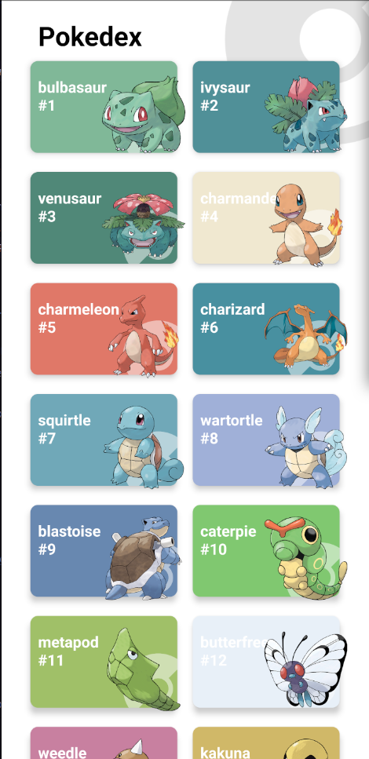
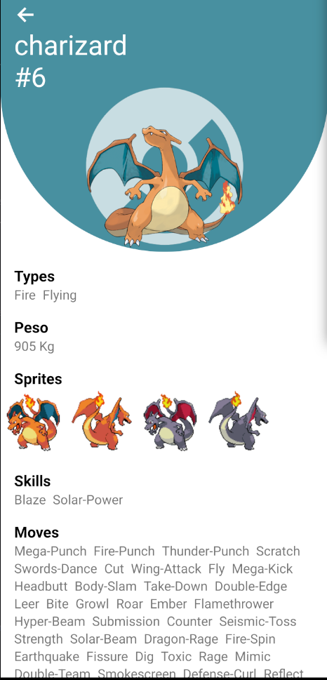
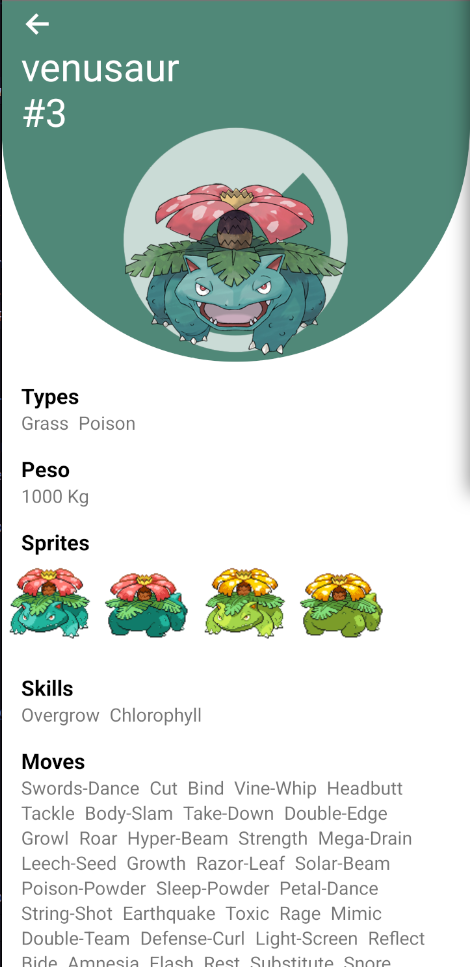

# React Native Pokedex App

Este es un proyecto de una Pokedex móvil desarrollada con React Native y TypeScript. La aplicación consume la API de Pokémon para mostrar una lista de Pokémon, junto con sus imágenes y detalles.





## Características

-   **Paginación Infinita:** Carga automáticamente más Pokémon a medida que el usuario se desplaza hacia abajo en la lista principal.
-   **Navegación:** Utiliza `react-navigation` para navegar entre la lista principal y la vista de detalles de cada Pokémon.
-   **Tipado con TypeScript:** El proyecto está completamente tipado para asegurar un código más robusto y fácil de mantener.
-   **Gestión de Estado:** Utiliza `useState` y `useEffect` de React para manejar el estado de la aplicación, como la lista de Pokémon y el estado de carga.

## Tecnologías Utilizadas

-   **React Native:** Framework para el desarrollo de aplicaciones móviles multiplataforma.
-   **TypeScript:** Lenguaje de programación que añade tipado estático a JavaScript.
-   **React Navigation:** Biblioteca de navegación para aplicaciones de React Native.
-   **Axios / Fetch API:** Para consumir datos de la API de Pokémon.

## Requisitos Previos

Asegúrate de tener instalado lo siguiente en tu entorno de desarrollo:

-   Node.js (versión 14 o superior)
-   Yarn o npm
-   JDK (Java Development Kit)
-   Android Studio (para emulador y SDK de Android)

## Instalación

1.  Clona el repositorio:
    ```bash
    git clone [https://github.com/AgustinSantillan/Aplicacion-RN-Pokemon-App.git](https://github.com/AgustinSantillan/Aplicacion-RN-Pokemon-App.git)
    ```

2.  Navega al directorio del proyecto:
    ```bash
    cd Aplicacion-RN-Pokemon-App
    ```

3.  Instala las dependencias:
    ```bash
    yarn install
    # o si usas npm
    # npm install
    ```

## Cómo ejecutar la aplicación

### En un emulador o dispositivo Android

1.  Asegúrate de que el Metro Bundler esté corriendo en una terminal:
    ```bash
    yarn start
    ```

2.  En una terminal **separada**, ejecuta el siguiente comando para construir e instalar la app en tu emulador o dispositivo conectado:
    ```bash
    yarn android
    ```

### En un emulador o dispositivo iOS

1.  Asegúrate de que el Metro Bundler esté corriendo en una terminal:
    ```bash
    yarn start
    ```

2.  En una terminal **separada**, ejecuta el siguiente comando para construir e instalar la app en tu emulador o dispositivo conectado:
    ```bash
    yarn ios
    ```
